# OmniKart UI - Frontend Design Document

**Version:** 2.0 Beta
**Package:** `market-sentinel-ui`
**Last Updated:** 2026-04-14

---

## Table of Contents

1. [Overview](#1-overview)
2. [Tech Stack](#2-tech-stack)
3. [Architecture](#3-architecture)
4. [Directory Structure](#4-directory-structure)
5. [Component Architecture](#5-component-architecture)
6. [State Management](#6-state-management)
7. [API Integration](#7-api-integration)
8. [Data Models](#8-data-models)
9. [UI / UX Design](#9-ui--ux-design)
10. [Styling Architecture](#10-styling-architecture)
11. [Build & Bundle Pipeline](#11-build--bundle-pipeline)
12. [Deployment Architecture](#12-deployment-architecture)
13. [CI/CD Pipeline](#13-cicd-pipeline)
14. [Environment Configuration](#14-environment-configuration)
15. [Security Considerations](#15-security-considerations)
16. [Future Improvements](#16-future-improvements)

---

## 1. Overview

### 1.1 Purpose

OmniKart UI is a **product price comparison** single-page application. Users paste a product URL from an e-commerce marketplace (Amazon, Flipkart, etc.) and the application scans multiple platforms to find better deals, alternatives, and price comparisons in real time.

### 1.2 Core User Flow

```
User pastes product URL → Backend scrapes marketplaces → UI displays comparison results
```

### 1.3 Key Features

- Single-input search interface for product URLs
- Real-time price comparison across marketplaces
- Confidence-scored alternative product suggestions
- Platform availability status tracking
- Responsive design (mobile through desktop)

---

## 2. Tech Stack

| Layer         | Technology                    | Version  |
|---------------|-------------------------------|----------|
| Framework     | React                         | 19.2.4   |
| Build Tool    | Vite                          | 8.0.1    |
| Language      | JavaScript (ES2020+)          | -        |
| Styling       | Tailwind CSS                  | 4.2.2    |
| PostCSS       | autoprefixer + PostCSS        | 8.5.8    |
| Linting       | ESLint                        | 9.39.4   |
| HTTP          | Native Fetch API              | -        |
| Server        | Nginx (production)            | Alpine   |
| Container     | Docker (multi-stage)          | -        |
| CI/CD         | GitHub Actions                | -        |
| Registry      | GitHub Container Registry     | -        |

### 2.1 Dependency Philosophy

The project follows a **minimal dependency** approach:

- **No routing library** -- single-page with conditional rendering
- **No state management library** -- React hooks only
- **No HTTP client library** -- native `fetch()`
- **No CSS-in-JS** -- Tailwind utility classes only
- **No authentication library** -- public-facing; auth delegated to backend

**Production dependencies are limited to `react` and `react-dom` only.**

---

## 3. Architecture

### 3.1 High-Level System Architecture

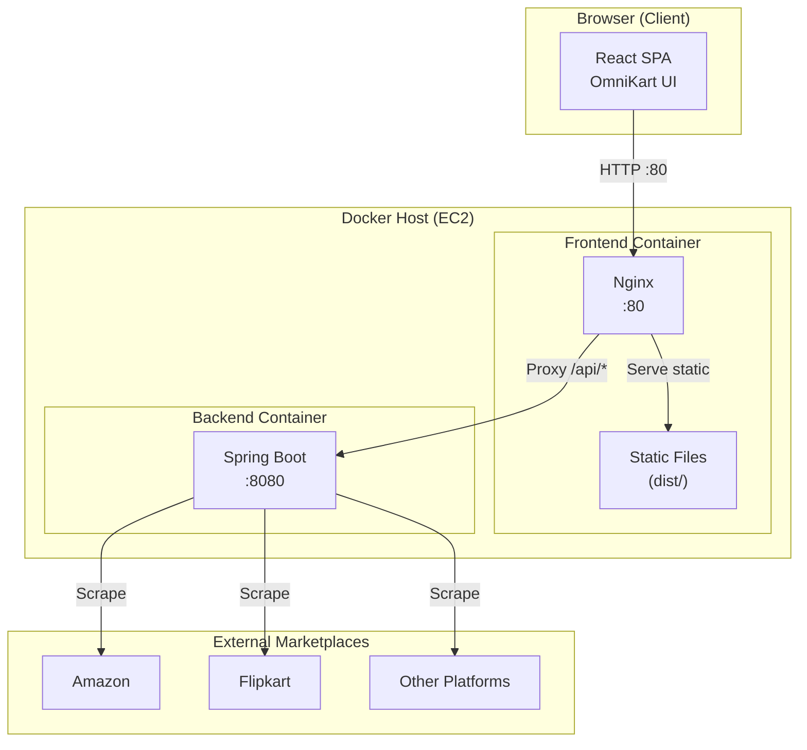

### 3.2 Request Flow

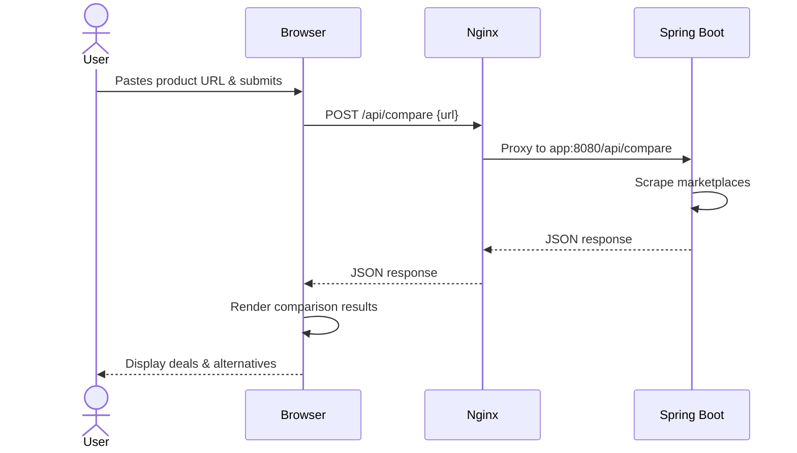

### 3.3 Frontend Application Architecture

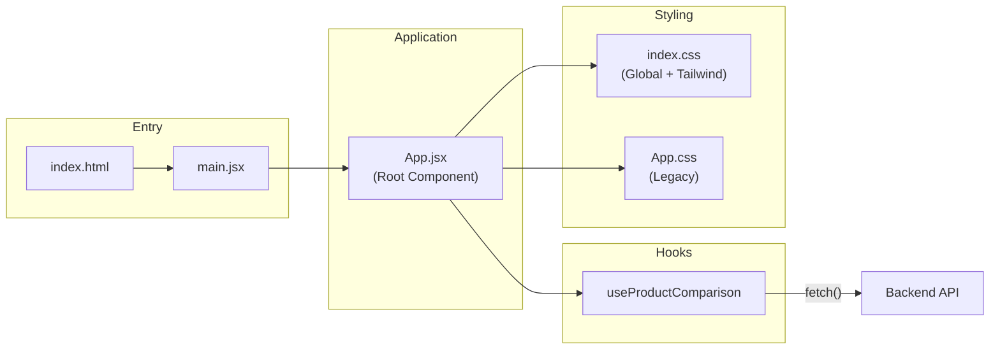

---

## 4. Directory Structure

```
OmniKart-UI/
├── .github/
│   └── workflows/
│       └── ci-cd.yml               # GitHub Actions CI/CD pipeline
├── public/
│   ├── favicon.svg                  # Browser tab icon
│   └── icons.svg                    # SVG icon sprite
├── src/
│   ├── main.jsx                     # React DOM entry point
│   ├── App.jsx                      # Root component (all UI)
│   ├── App.css                      # Legacy supplementary styles
│   ├── index.css                    # Global styles + Tailwind directives
│   ├── assets/
│   │   └── hero.png                 # Hero image asset
│   └── hooks/
│       └── useProductComparison.js  # API integration hook
├── Dockerfile                       # Multi-stage build (Node → Nginx)
├── nginx.conf                       # Nginx reverse proxy config
├── index.html                       # HTML shell
├── vite.config.js                   # Vite build configuration
├── tailwind.config.js               # Tailwind CSS configuration
├── postcss.config.js                # PostCSS plugin configuration
├── eslint.config.js                 # ESLint flat config
├── package.json                     # Dependencies & scripts
└── package-lock.json
```

---

## 5. Component Architecture

### 5.1 Component Tree

The application uses a **monolithic component** pattern -- all UI resides in a single `App.jsx` file with inline conditional rendering.

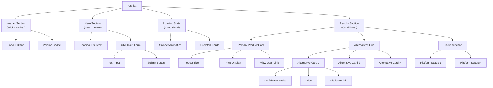

### 5.2 Component Responsibilities

| Section             | Responsibility                                                  |
|---------------------|-----------------------------------------------------------------|
| **Header**          | Persistent navigation bar with logo and version badge           |
| **Hero / Search**   | URL input form, form validation, submission handling             |
| **Loading State**   | Spinner animation + pulsating skeleton cards during API call     |
| **Primary Card**    | Displays the source product with title, price, and external link |
| **Alternatives Grid** | Renders marketplace alternatives with confidence badges        |
| **Status Sidebar**  | Shows per-platform scan status (success / skipped)              |

### 5.3 Confidence Badge Logic

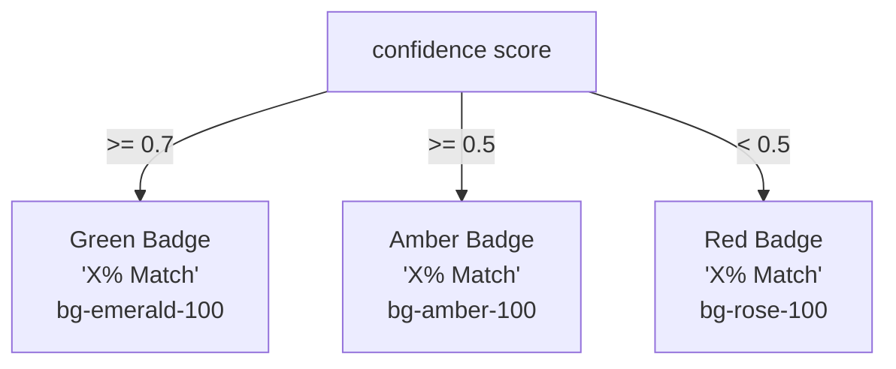

---

## 6. State Management

### 6.1 Approach

State is managed entirely through **React's built-in hooks** (`useState`). No external state management library is used.

### 6.2 State Diagram

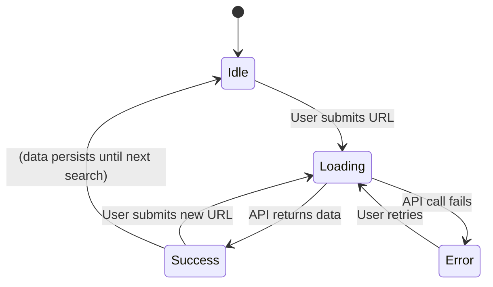

### 6.3 State Variables

| Variable   | Type               | Owner Hook / Component       | Description                        |
|------------|--------------------|-----------------------------|-------------------------------------|
| `inputUrl` | `string`           | `App.jsx` (useState)        | Current value of the URL input      |
| `data`     | `object \| null`   | `useProductComparison` hook | Parsed API response                 |
| `loading`  | `boolean`          | `useProductComparison` hook | Whether an API call is in progress  |
| `error`    | `string \| null`   | `useProductComparison` hook | Error message from failed API call  |

### 6.4 Data Flow

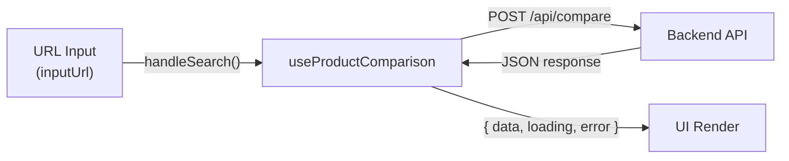

---

## 7. API Integration

### 7.1 API Contract

**Endpoint:** `POST /api/compare`

**Base URL Resolution:**

| Environment | Base URL                 | Resolution Strategy              |
|-------------|--------------------------|----------------------------------|
| Development | `http://localhost:8080`  | `VITE_API_URL` env variable      |
| Production  | ` ` (empty string)      | Relative path → Nginx proxies    |

```javascript
const API_BASE = import.meta.env.VITE_API_URL || '';
```

### 7.2 Request / Response Schema

**Request:**
```json
{
  "url": "https://www.amazon.in/dp/B0EXAMPLE"
}
```

**Response:**
```json
{
  "results": [
    {
      "product": {
        "title": "Product Name",
        "price": "₹5,999",
        "productUrl": "https://..."
      },
      "platform": "Amazon",
      "status": "success"
    }
  ],
  "similarProducts": [
    {
      "product": {
        "title": "Alternative Product",
        "price": "₹4,499",
        "productUrl": "https://..."
      },
      "platform": "Flipkart",
      "confidence": 0.85
    }
  ]
}
```

### 7.3 Error Handling

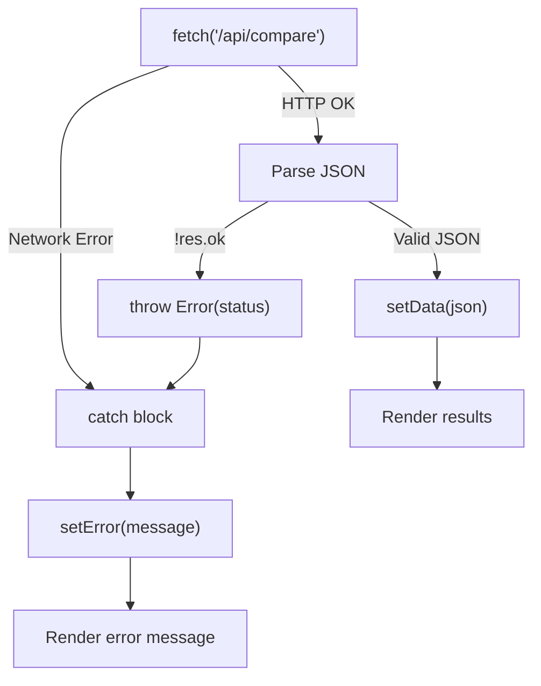

- No retry logic implemented
- No request timeout configured
- No request cancellation (AbortController) on component unmount
- Error message displayed inline below the search form

---

## 8. Data Models

### 8.1 Class Diagram

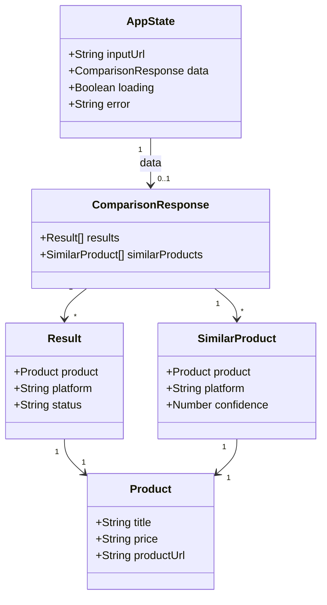

### 8.2 Type Definitions (Logical)

While the project uses plain JavaScript, the logical types are:

```
Product {
    title:      string
    price:      string          // Pre-formatted (e.g., "₹5,999")
    productUrl: string          // Full URL to product page
}

Result {
    product:    Product
    platform:   string          // "Amazon" | "Flipkart" | ...
    status:     "success" | "skipped"
}

SimilarProduct {
    product:    Product
    platform:   string
    confidence: number          // 0.0 to 1.0
}

ComparisonResponse {
    results:         Result[]
    similarProducts: SimilarProduct[]
}
```

---

## 9. UI / UX Design

### 9.1 Page Layout

```
┌─────────────────────────────────────────────────────┐
│  HEADER (sticky)                                    │
│  [Logo: OmniKart]                    [v2.0 Beta]    │
├─────────────────────────────────────────────────────┤
│                                                     │
│         Find the Best Deal. Instantly.              │
│                                                     │
│  ┌─────────────────────────────────────────────┐    │
│  │  Paste any product link...          [Search] │    │
│  └─────────────────────────────────────────────┘    │
│                                                     │
├─────────────────────────────────────────────────────┤
│                                                     │
│  YOUR PRODUCT                                       │
│  ┌─────────────────────────────────────────────┐    │
│  │  [Image]  Title                              │    │
│  │           Price: ₹X,XXX                      │    │
│  │           Platform: Amazon                   │    │
│  │           [View on Amazon →]                 │    │
│  └─────────────────────────────────────────────┘    │
│                                                     │
│  MARKET ALTERNATIVES             STATUS SIDEBAR     │
│  ┌──────────┐ ┌──────────┐    ┌──────────────────┐  │
│  │ Alt #1   │ │ Alt #2   │    │ Amazon ✓ Found   │  │
│  │ ₹X,XXX  │ │ ₹X,XXX  │    │ Flipkart ✓ Found │  │
│  │ 85% ●   │ │ 72% ●   │    │ Croma — Skipped  │  │
│  └──────────┘ └──────────┘    └──────────────────┘  │
│  ┌──────────┐ ┌──────────┐                          │
│  │ Alt #3   │ │ Alt #4   │                          │
│  │ ₹X,XXX  │ │ ₹X,XXX  │                          │
│  │ 60% ●   │ │ 45% ●   │                          │
│  └──────────┘ └──────────┘                          │
│                                                     │
└─────────────────────────────────────────────────────┘
```

### 9.2 Responsive Breakpoints

| Breakpoint | Width   | Layout Behavior                            |
|------------|---------|---------------------------------------------|
| Default    | < 640px | Single column, full-width cards             |
| `sm:`      | 640px+  | 2-column alternative grid                   |
| `md:`      | 768px+  | Sidebar appears alongside grid              |
| `lg:`      | 1024px+ | 3-column alternative grid + sticky sidebar  |

### 9.3 Color Palette

| Role        | Color                | Tailwind Class     | Usage                          |
|-------------|----------------------|--------------------|--------------------------------|
| Primary     | Indigo 600           | `indigo-600`       | Buttons, links, accents        |
| Accent      | Violet / Purple      | `violet-*`         | Gradient highlights            |
| Neutral     | Slate 50–900         | `slate-*`          | Backgrounds, text, borders     |
| Success     | Emerald 500          | `emerald-*`        | High confidence, success status|
| Warning     | Amber 500            | `amber-*`          | Medium confidence              |
| Danger      | Rose 500             | `rose-*`           | Low confidence, errors         |
| Background  | Slate 50 + gradient  | `bg-slate-50`      | Page background                |

### 9.4 UI States

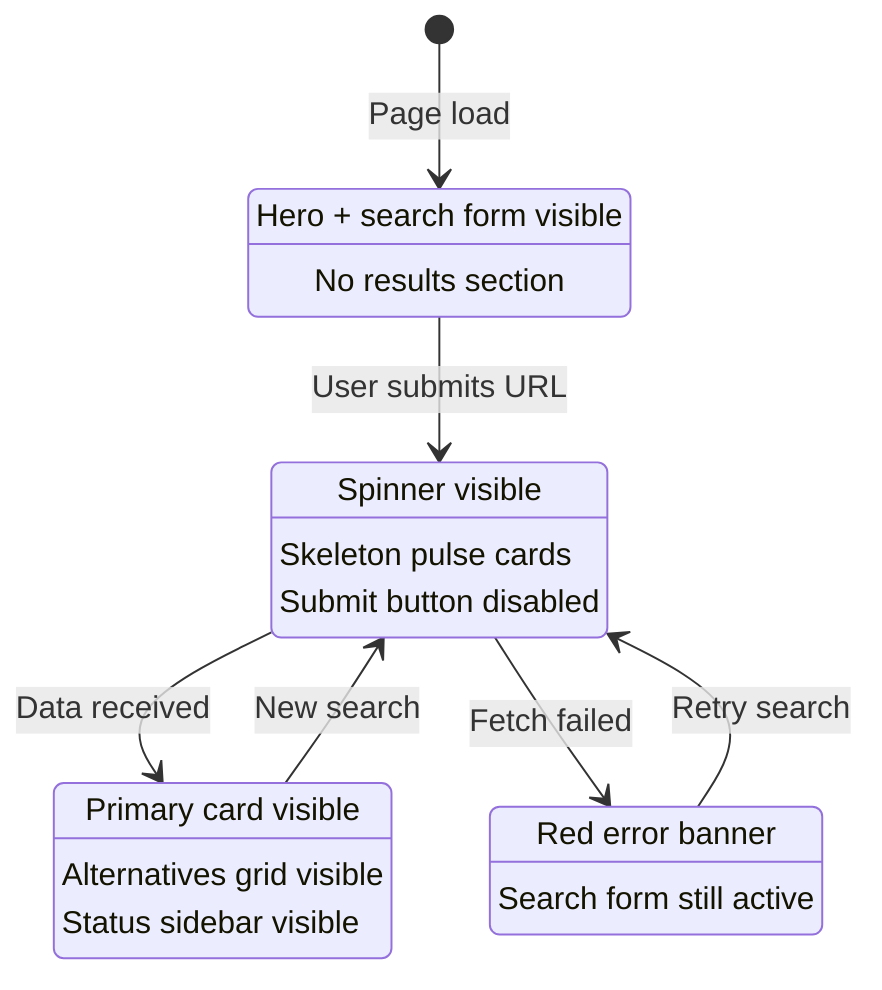

---

## 10. Styling Architecture

### 10.1 Approach

The project uses a **utility-first CSS** approach via Tailwind CSS. No component-scoped CSS, CSS modules, or CSS-in-JS libraries are used.

### 10.2 Style Layers

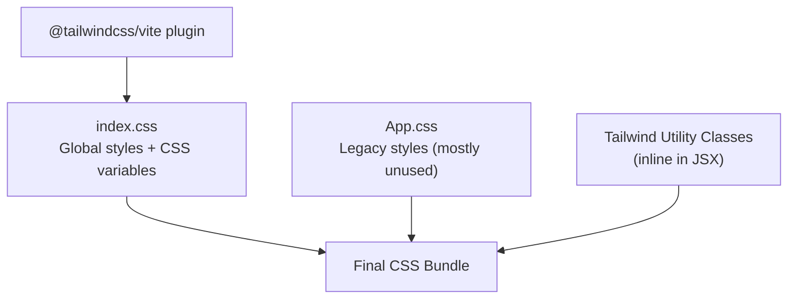

### 10.3 Global CSS Variables

```css
:root {
    --brand-gradient: linear-gradient(135deg, #6366f1 0%, #a855f7 100%);
}
```

### 10.4 Design Tokens

| Token              | Value                              |
|--------------------|------------------------------------|
| Font Family        | Inter, system-ui, sans-serif       |
| Border Radius      | `rounded-xl` to `rounded-3xl`     |
| Shadow             | `shadow-lg` to `shadow-2xl`       |
| Transition         | Tailwind defaults (150ms–300ms)    |
| Spacing Base       | 4px (Tailwind default scale)       |
| Max Content Width  | `max-w-7xl` (80rem / 1280px)      |

### 10.5 Animations

| Animation          | Implementation             | Usage                      |
|--------------------|----------------------------|----------------------------|
| Spinner            | `animate-spin`             | Loading indicator          |
| Skeleton Pulse     | `animate-pulse`            | Placeholder cards          |
| Button Press       | `active:scale-95`          | Submit button feedback     |
| Hover Effects      | `hover:shadow-*`, `hover:border-*` | Card interactions   |
| Scroll Behavior    | `scroll-behavior: smooth`  | Page navigation            |

---

## 11. Build & Bundle Pipeline

### 11.1 Build Process

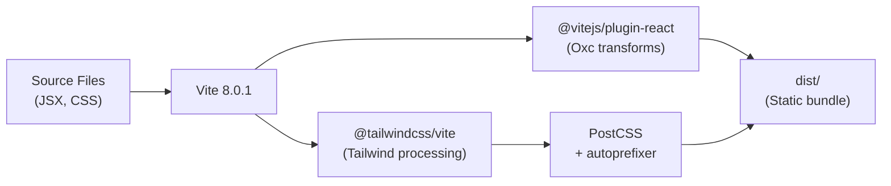

### 11.2 NPM Scripts

| Script          | Command         | Purpose                               |
|-----------------|-----------------|---------------------------------------|
| `npm run dev`   | `vite`          | Start dev server (localhost:5173)     |
| `npm run build` | `vite build`    | Production build to `dist/`           |
| `npm run preview` | `vite preview`| Preview production build locally      |
| `npm run lint`  | `eslint .`      | Run ESLint checks                     |

### 11.3 Vite Configuration

```javascript
// vite.config.js
export default defineConfig({
  plugins: [
    react(),       // React JSX transforms (Oxc)
    tailwindcss()  // Tailwind CSS processing
  ]
})
```

---

## 12. Deployment Architecture

### 12.1 Docker Multi-Stage Build

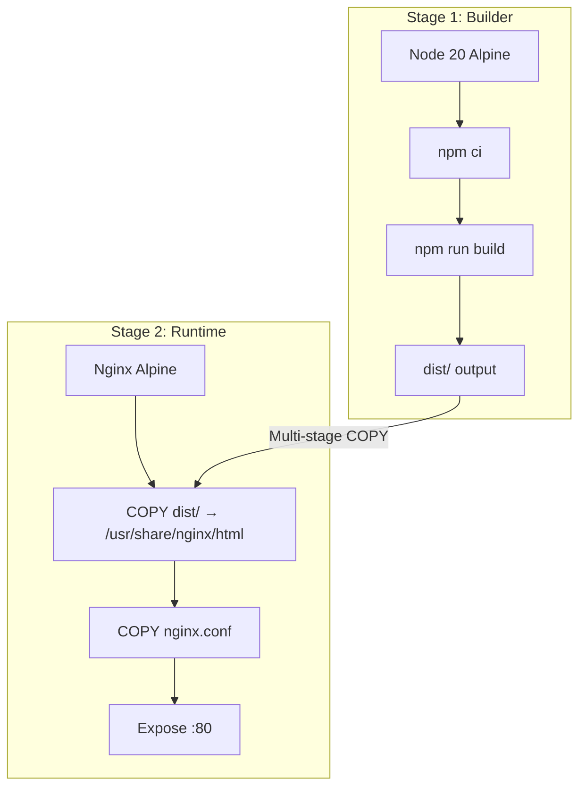

### 12.2 Nginx Configuration

```
                    ┌──────────────┐
                    │   Client     │
                    │  (Browser)   │
                    └──────┬───────┘
                           │
                    ┌──────▼───────┐
                    │   Nginx :80  │
                    └──────┬───────┘
                           │
              ┌────────────┴────────────┐
              │                         │
    ┌─────────▼─────────┐   ┌──────────▼──────────┐
    │  Static Files     │   │  /api/* Proxy        │
    │  (dist/)          │   │  → app:8080          │
    │                   │   │                      │
    │  try_files $uri   │   │  proxy_pass          │
    │  → /index.html    │   │  http://app:8080     │
    └───────────────────┘   └─────────────────────┘
```

**Key Nginx behaviors:**
- `/api/*` requests are proxied to the Spring Boot backend at `app:8080`
- All other requests serve static files from `dist/`
- SPA fallback: unmatched routes return `index.html` (enabling client-side routing if added later)
- Proxy headers forwarded: `Host`, `X-Real-IP`, `X-Forwarded-For`, `X-Forwarded-Proto`

### 12.3 Production Infrastructure

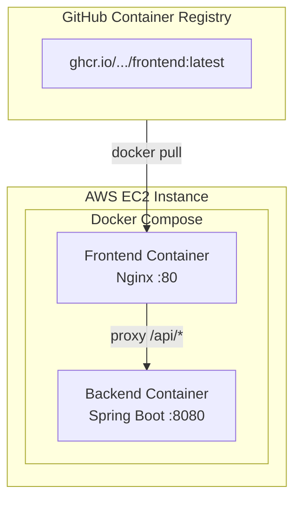

---

## 13. CI/CD Pipeline

### 13.1 Pipeline Overview

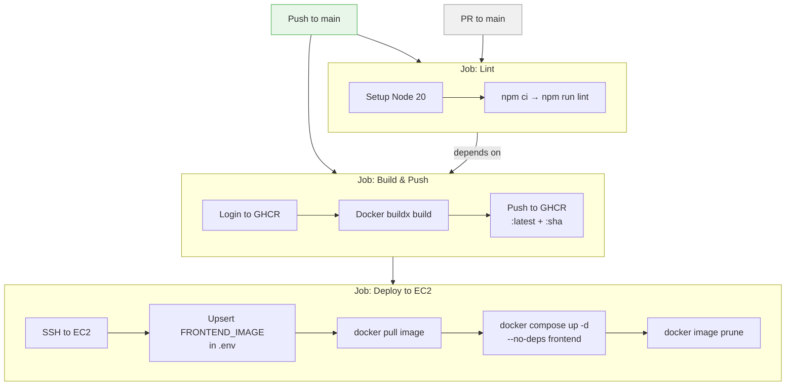

### 13.2 Trigger Rules

| Event           | Lint | Build & Push | Deploy |
|-----------------|------|--------------|--------|
| Push to `main`  | Yes  | Yes          | Yes    |
| PR to `main`    | Yes  | No           | No     |

### 13.3 Image Tagging

Each build produces two tags:
- `ghcr.io/<owner>/<repo>/frontend:latest`
- `ghcr.io/<owner>/<repo>/frontend:<commit-sha>`

---

## 14. Environment Configuration

### 14.1 Environment Variables

| Variable       | Scope     | Default              | Description                     |
|----------------|-----------|----------------------|---------------------------------|
| `VITE_API_URL` | Build-time| `""` (empty)         | Backend API base URL            |

### 14.2 Environment-Specific Behavior

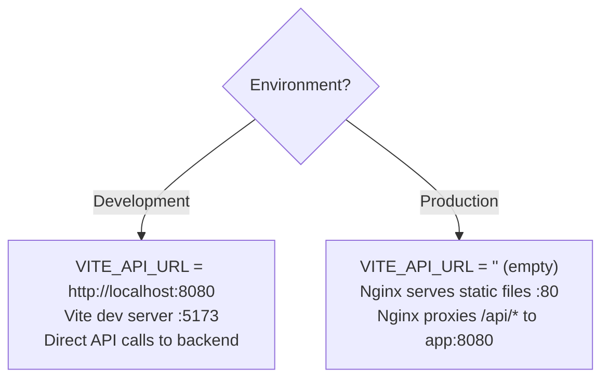

### 14.3 GitHub Actions Secrets

| Secret        | Purpose                          |
|---------------|----------------------------------|
| `GITHUB_TOKEN`| Auto-provided; GHCR login        |
| `EC2_HOST`    | EC2 instance hostname/IP         |
| `EC2_USER`    | SSH username                     |
| `EC2_SSH_KEY` | SSH private key for deployment   |

---

## 15. Security Considerations

### 15.1 Current State

| Area                    | Status           | Notes                                      |
|-------------------------|------------------|--------------------------------------------|
| Authentication          | Not implemented  | Public-facing; no user accounts            |
| Authorization           | Not implemented  | All endpoints open                         |
| CORS                    | Not applicable   | Nginx reverse proxy eliminates CORS issues |
| Input Validation        | Backend only     | Frontend sends raw URL to backend          |
| XSS Protection          | React default    | JSX auto-escapes rendered content          |
| HTTPS                   | Not configured   | Should be added via load balancer or cert  |
| Rate Limiting           | Not implemented  | Backend or Nginx should handle this        |
| Content Security Policy | Not configured   | Recommended for production                 |

### 15.2 Security Architecture

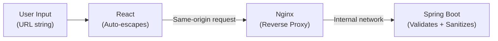

---

## 16. Future Improvements

### 16.1 Recommended Enhancements

| Area                    | Recommendation                                                       |
|-------------------------|----------------------------------------------------------------------|
| Component Decomposition | Extract Header, SearchForm, ProductCard, ConfidenceBadge, StatusPanel into separate components |
| Routing                 | Add React Router for multi-page support (history, wishlist, settings)|
| TypeScript              | Migrate to TypeScript for type safety (types already installed)      |
| Error Handling          | Add request timeouts, retry logic, AbortController on unmount        |
| Testing                 | Add Vitest + React Testing Library for unit/integration tests        |
| State Management        | Consider Zustand or React Query as complexity grows                  |
| Authentication          | Add OAuth/JWT for user accounts and saved comparisons                |
| PWA                     | Add service worker for offline support and caching                   |
| HTTPS                   | Add TLS termination at load balancer or Nginx level                  |
| Accessibility           | Add ARIA labels, keyboard navigation, screen reader support          |
| Analytics               | Add event tracking for search patterns and user behavior             |
| Caching                 | Cache API responses to avoid redundant scraping                      |

### 16.2 Suggested Component Decomposition

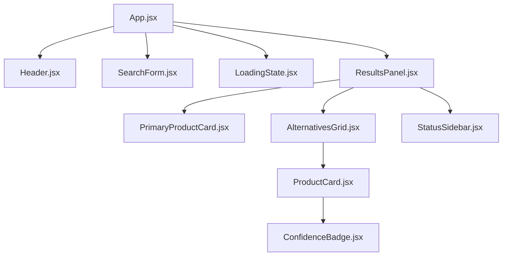

---

*This document describes the OmniKart UI frontend as of the initial release (v2.0 Beta). It should be updated as the architecture evolves.*
