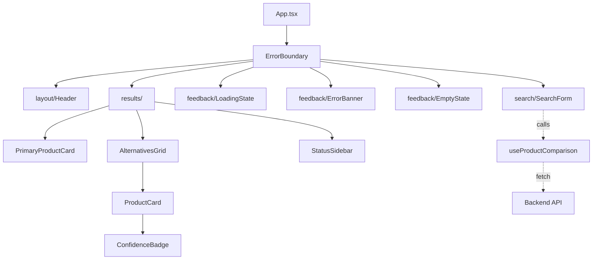
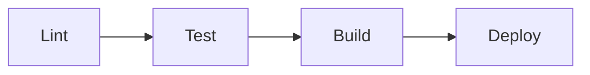
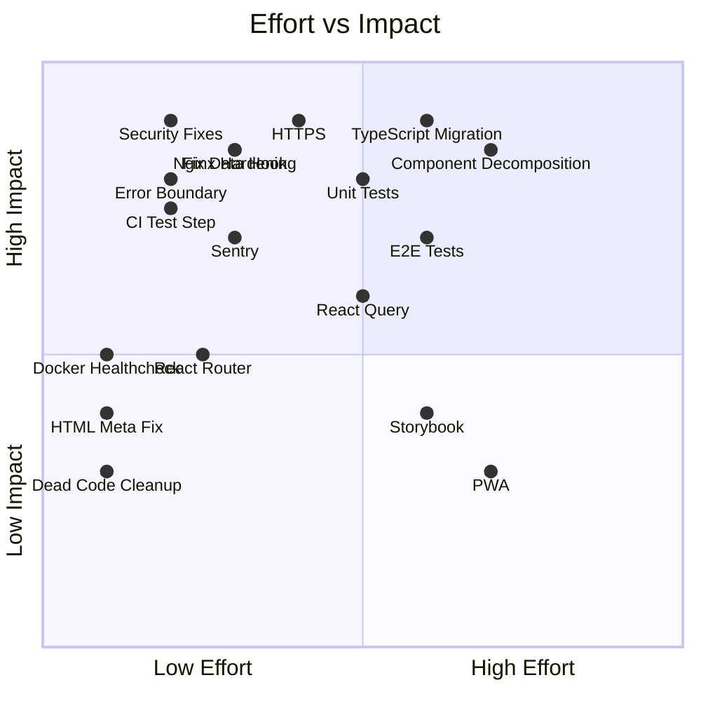
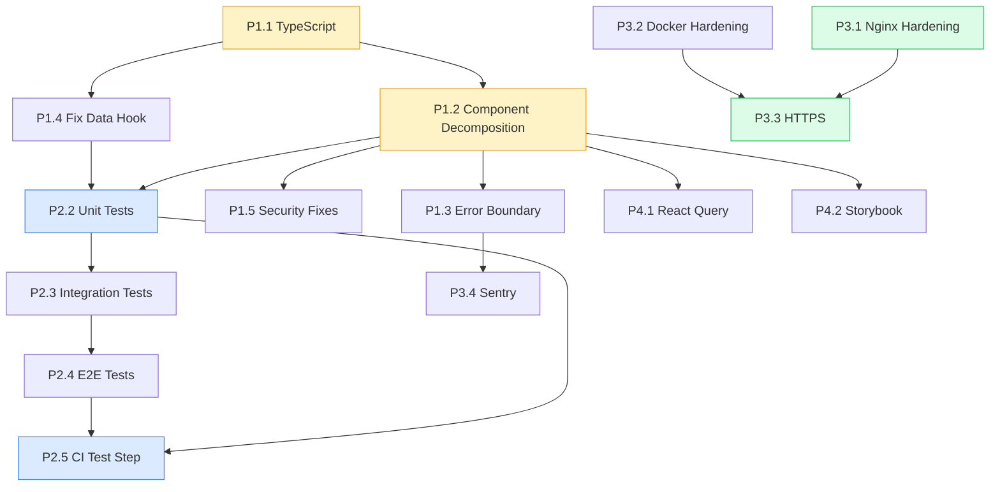

# OmniKart UI - Production Readiness Plan

**Created:** 2026-04-14
**Companion doc:** [DESIGN.md](./DESIGN.md) (Section 17: Gap Analysis)

---

## Phased Roadmap

```
Phase 1: Foundation         ██████████░░░░░░░░░░  (structural, blocks everything)
Phase 2: Quality Gates      ░░░░░░████████░░░░░░  (testing, CI)
Phase 3: Prod Hardening     ░░░░░░░░░░░░████████  (infra, security, perf)
Phase 4: Scale & DX         ░░░░░░░░░░░░░░░░████  (nice-to-have, ongoing)
```

---

## Phase 1: Foundation

> Goal: Restructure the app so it's maintainable, type-safe, and doesn't embarrass us in a code review.

### P1.1 -- TypeScript Migration

**Why:** `@types/react` is already installed but unused. JS-only means zero compile-time safety for props, API responses, or state -- bugs that TS catches for free today become runtime crashes in production.

**Scope:**
- [x] Rename `.jsx` -> `.tsx`, `.js` -> `.ts`
- [x] Add `tsconfig.json` (strict mode)
- [x] Update `vite.config.js` -> `vite.config.ts`
- [x] Update `eslint.config.js` with `@typescript-eslint`
- [x] Define explicit interfaces for all API types:

```typescript
// src/types/api.ts
export interface Product {
  title: string;
  price: string;
  productUrl: string;
}

export interface PlatformResult {
  product: Product;
  platform: string;
  status: 'success' | 'skipped';
}

export interface SimilarProduct {
  product: Product;
  platform: string;
  confidence: number;
}

export interface ComparisonResponse {
  results: PlatformResult[];
  similarProducts: SimilarProduct[];
}
```

**Files touched:** Every `.jsx`/`.js` file, plus new `tsconfig.json`, `src/types/`

---

### P1.2 -- Component Decomposition

**Why:** 180-line monolithic `App.jsx` is untestable, unreadable, and blocks parallel development.

**Target structure:**

```
src/
├── components/
│   ├── layout/
│   │   └── Header.tsx              # Sticky navbar + logo + version badge
│   ├── search/
│   │   └── SearchForm.tsx          # URL input + submit + validation
│   ├── results/
│   │   ├── PrimaryProductCard.tsx  # Source product display
│   │   ├── AlternativesGrid.tsx    # Grid wrapper for alternative cards
│   │   ├── ProductCard.tsx         # Individual alternative card
│   │   ├── ConfidenceBadge.tsx     # Color-coded match percentage
│   │   └── StatusSidebar.tsx       # Per-platform scan status
│   ├── feedback/
│   │   ├── ErrorBanner.tsx         # Error state display
│   │   ├── EmptyState.tsx          # No-results feedback
│   │   └── LoadingState.tsx        # Spinner + skeleton cards
│   └── ErrorBoundary.tsx           # Catch-all render error handler
├── hooks/
│   └── useProductComparison.ts     # API hook (migrated to TS)
├── types/
│   └── api.ts                      # Shared API interfaces
├── lib/
│   └── validation.ts               # URL validation utility
├── App.tsx
├── main.tsx
└── index.css
```

**Component dependency diagram:**



**Extraction rules:**
- Each component gets its own file -- no barrel `index.ts` re-exports (YAGNI)
- Props are typed with explicit interfaces, co-located in the component file
- No prop drilling deeper than 2 levels -- if needed, lift state or use context
- Components are pure/presentational where possible; data fetching stays in hooks

---

### P1.3 -- Error Boundary + Error/Empty States

**Why:** Today, any render error = white screen. And the `error` state is tracked but never displayed.

**Tasks:**
- [x] Add `ErrorBoundary.tsx` wrapping `<App />` in `main.tsx`
- [x] Render `ErrorBanner` when `error` is non-null (currently silent)
- [x] Render `EmptyState` when `data.results` is empty or `data.similarProducts` is empty
- [x] Show user-friendly messages, not raw error strings

---

### P1.4 -- Fix Data Fetching Hook

**Why:** Stale response races, no cancellation, misleading error text.

**Tasks:**
- [x] Add `AbortController` -- abort in-flight request when a new one starts
- [x] Add cleanup on unmount (return abort from `useEffect` or track ref)
- [x] Fix error message: `"Server expansion failed"` -> `"Failed to fetch comparison results. Please try again."`
- [x] Add basic request timeout (10s via `AbortSignal.timeout(10000)`)
- [x] Add URL validation before fetch (check valid URL format, reject empty/malformed)

```typescript
// Simplified pattern
const fetchComparison = async (url: string) => {
  abortControllerRef.current?.abort();
  const controller = new AbortController();
  abortControllerRef.current = controller;

  setLoading(true);
  setError(null);

  try {
    const res = await fetch(`${API_BASE}/api/compare`, {
      method: 'POST',
      headers: { 'Content-Type': 'application/json' },
      body: JSON.stringify({ url }),
      signal: AbortSignal.any([
        controller.signal,
        AbortSignal.timeout(10_000),
      ]),
    });
    if (!res.ok) throw new Error(`Comparison failed (HTTP ${res.status})`);
    setData(await res.json());
  } catch (err) {
    if (err.name !== 'AbortError') setError(err.message);
  } finally {
    setLoading(false);
  }
};
```

---

### P1.5 -- Security Fixes (Frontend)

**Why:** External links without `rel="noopener noreferrer"` enable reverse tabnapping. Missing ARIA labels fail WCAG.

**Tasks:**
- [x] All external `<a>` tags: add `target="_blank" rel="noopener noreferrer"`
- [x] Search input: add `aria-label="Product URL"`, `type="url"`
- [x] Submit button: add `aria-label` for loading state
- [x] Result cards: add `role="article"` or semantic `<article>` tags
- [x] Use stable keys: replace `key={idx}` with `key={item.product.productUrl}` or `key={`${item.platform}-${idx}`}`

---

### P1.6 -- Add React Router

**Why:** Even with one page, Router enables deep-linking, future pages, and proper browser history.

**Tasks:**
- [x] Install `react-router-dom`
- [x] Wrap app in `<BrowserRouter>`
- [x] Define routes: `/` (home/search), `*` (404 page)
- [x] Structure allows future routes: `/history`, `/about`, etc.

---

### P1.7 -- Cleanup & Polish

**Tasks:**
- [x] Delete `App.css` (185 lines of dead Vite template code)
- [x] Delete unused assets: `react.svg`, `vite.svg`, `public/icons.svg`
- [x] Fix `index.html`:
  - Title: `OmniKart - Find the Best Deal Instantly`
  - Add `<meta name="description" content="...">`
  - Add Open Graph tags (`og:title`, `og:description`, `og:image`)
- [x] Rename package: `"name": "market-sentinel-ui"` -> `"name": "omnikart-ui"`

---

## Phase 2: Quality Gates

> Goal: Prove the app works and keep it working. No code merges without automated verification.

### P2.1 -- Testing Setup

**Tasks:**
- [x] Install Vitest + React Testing Library + jsdom
- [x] Add `vitest.config.ts` with jsdom environment
- [x] Add `npm run test` and `npm run test:coverage` scripts
- [x] Create test directory structure mirroring `src/`

---

### P2.2 -- Unit Tests

**Priority order:**

| Test File | What It Covers | Priority |
|-----------|----------------|----------|
| `useProductComparison.test.ts` | Hook: fetch, abort, error, loading states | Must |
| `validation.test.ts` | URL validation: valid URLs, empty, malformed | Must |
| `ConfidenceBadge.test.tsx` | Renders correct color/text for 0.8, 0.6, 0.3 | Must |
| `SearchForm.test.tsx` | Submit calls handler, disabled during loading | Must |
| `ErrorBoundary.test.tsx` | Catches errors, renders fallback | Should |
| `ProductCard.test.tsx` | Renders title, price, link; handles missing fields | Should |
| `EmptyState.test.tsx` | Renders correct message | Nice |

**Target: 80%+ line coverage on `src/`**

---

### P2.3 -- Integration Tests

- [ ] Full search flow: type URL -> submit -> mock API -> verify results render
- [ ] Error flow: submit -> API 500 -> verify error banner
- [ ] Empty flow: submit -> API returns `[]` -> verify empty state

---

### P2.4 -- E2E Test (Single Happy Path)

- [ ] Install Playwright
- [ ] One test: load page -> paste URL -> submit -> verify at least one result card visible
- [ ] Add to CI as a separate job (runs against dev server)

---

### P2.5 -- CI Pipeline Update

**Update `.github/workflows/ci-cd.yml`:**

```yaml
# Add between lint and build jobs:
test:
  name: Test
  runs-on: ubuntu-latest
  needs: lint
  steps:
    - uses: actions/checkout@v4
    - uses: actions/setup-node@v4
      with: { node-version: '20', cache: 'npm' }
    - run: npm ci
    - run: npm run test -- --coverage
    - run: npx playwright install --with-deps
    - run: npx playwright test
```

**Updated pipeline flow:**



---

## Phase 3: Production Hardening

> Goal: Ship a container that's secure, fast, and observable.

### P3.1 -- Nginx Hardening

**Update `nginx.conf`:**

```nginx
server {
    listen 80;
    root /usr/share/nginx/html;
    index index.html;

    # ── Security Headers ──
    add_header X-Frame-Options "DENY" always;
    add_header X-Content-Type-Options "nosniff" always;
    add_header Referrer-Policy "strict-origin-when-cross-origin" always;
    add_header Permissions-Policy "camera=(), microphone=(), geolocation=()" always;
    add_header Content-Security-Policy "default-src 'self'; script-src 'self'; style-src 'self' 'unsafe-inline'; img-src 'self' data: https:; connect-src 'self';" always;

    # ── Gzip Compression ──
    gzip on;
    gzip_types text/plain text/css application/json application/javascript text/xml image/svg+xml;
    gzip_min_length 256;

    # ── Cache Control ──
    # Vite outputs hashed filenames (e.g., index-abc123.js) -- cache forever
    location /assets/ {
        expires 1y;
        add_header Cache-Control "public, immutable";
    }

    # index.html must never be cached (it references hashed assets)
    location = /index.html {
        add_header Cache-Control "no-cache, no-store, must-revalidate";
    }

    # ── API Proxy ──
    location /api/ {
        proxy_pass         http://app:8080;
        proxy_set_header   Host              $host;
        proxy_set_header   X-Real-IP         $remote_addr;
        proxy_set_header   X-Forwarded-For   $proxy_add_x_forwarded_for;
        proxy_set_header   X-Forwarded-Proto $scheme;
        proxy_read_timeout 30s;
    }

    # ── SPA Fallback ──
    location / {
        try_files $uri $uri/ /index.html;
    }
}
```

---

### P3.2 -- Docker Hardening

**Tasks:**
- [ ] Add `HEALTHCHECK` to Dockerfile:
  ```dockerfile
  HEALTHCHECK --interval=30s --timeout=3s --retries=3 \
    CMD wget -qO- http://localhost:80/ || exit 1
  ```
- [ ] Pin Nginx version: `nginx:1.27-alpine` instead of `nginx:alpine`
- [ ] Add `.dockerignore` review (ensure `node_modules`, `.git`, `*.md` excluded)
- [ ] Run Nginx as non-root user for security

---

### P3.3 -- HTTPS / TLS

**Options (pick one):**
- [ ] **Option A:** Add Cloudflare in front (simplest -- free SSL, CDN, DDoS)
- [ ] **Option B:** Add Certbot/Let's Encrypt sidecar container
- [ ] **Option C:** Terminate TLS at AWS ALB (if scaling to multiple instances)

---

### P3.4 -- Error Tracking

- [ ] Add Sentry (free tier) -- captures unhandled JS errors with stack traces
- [ ] Wire `ErrorBoundary` to report to Sentry
- [ ] Add Sentry release tracking tied to git SHA

---

### P3.5 -- Performance Baseline

- [ ] Run Lighthouse CI in pipeline, assert scores:
  - Performance >= 90
  - Accessibility >= 90
  - Best Practices >= 90
- [ ] Add `@vite/plugin-legacy` only if analytics show IE/old browser traffic
- [ ] Review bundle size with `npx vite-bundle-visualizer`

---

## Phase 4: Scale & DX

> Goal: Invest in developer experience and features that matter once there's real traffic.

### P4.1 -- Data Fetching Upgrade

- [ ] Replace raw `fetch` with **TanStack Query (React Query)**
  - Automatic caching (same URL = instant result)
  - Request deduplication
  - Background refetching
  - Built-in retry with exponential backoff
  - Devtools for debugging

---

### P4.2 -- Component Library / Storybook

- [ ] Install Storybook
- [ ] Write stories for: `ProductCard`, `ConfidenceBadge`, `SearchForm`, `ErrorBanner`, `EmptyState`
- [ ] Use for visual regression testing and design review

---

### P4.3 -- PWA Support

- [ ] Add `vite-plugin-pwa`
- [ ] Register service worker
- [ ] Add web app manifest (`name`, `icons`, `theme_color`)
- [ ] Offline fallback page

---

### P4.4 -- Analytics & Monitoring

- [ ] Add lightweight analytics (Plausible or PostHog)
- [ ] Track key events:
  - Search submitted (with platform detected from URL)
  - Result card clicked (which platform, confidence score)
  - Error rates
- [ ] Create dashboard for search volume, popular platforms, error rate

---

### P4.5 -- Search History & Saved Comparisons

- [ ] Add `localStorage`-based recent searches (no auth needed)
- [ ] Show recent searches below the search bar
- [ ] Future: user accounts + server-side saved comparisons

---

## Execution Priority Matrix



---

## Dependency Graph

Some tasks must happen in order. This graph shows what blocks what:



**Legend:** Yellow = Phase 1 | Blue = Phase 2 | Green = Phase 3

---

## Quick Wins (< 30 min each, do immediately)

These require no architectural changes and can be shipped today:

| Task | Issue Ref | Time |
|------|-----------|------|
| Delete `App.css` + unused assets | A6 | 2 min |
| Fix `<title>` and add meta tags | U1 | 5 min |
| Add `target="_blank" rel="noopener noreferrer"` to all links | S1 | 5 min |
| Fix error message typo in hook | D4 | 1 min |
| Add `aria-label` to search input and button | S2 | 5 min |
| Render error state in UI | D6 | 10 min |
| Replace `key={idx}` with stable keys | D5 | 5 min |

---

*This plan is a living document. Update task statuses as work progresses. Cross-reference [DESIGN.md](./DESIGN.md) Section 17 for the full gap analysis.*
